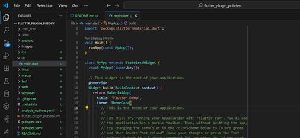
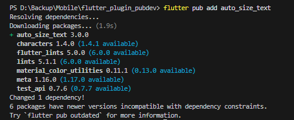
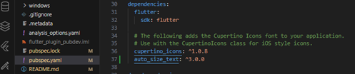
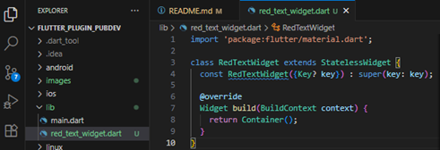
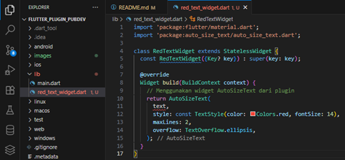
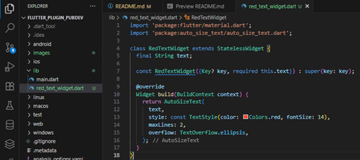
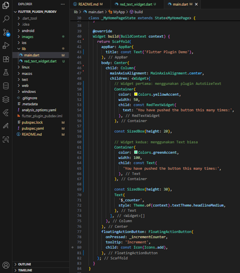
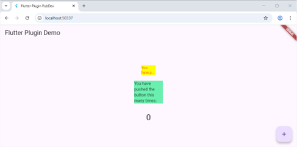

# 📱 Laporan Praktikum Pemrograman Mobile  

## Jobsheet 6 Flutter 3: Manajemen Plugin

---

## 🙋‍♀️ Identitas  
- **Nama**  : Karina Ika Indasa  
- **NIM**   : 2341760042  
- **Kelas** : SIB-3C  
- **Mata Kuliah** : Pemrograman Mobile  

---

## 🎯 Tujuan Praktikum  
1. Menjelaskan manfaat plugin 
2. Memasang plugin ke dalam project flutter
3. Memanfaatkan plugin dalam aplikasi

---

## 🛠️ Sumber Daya yang Dibutuhkan
- PC atau Laptop dengan spesifikasi minimum RAM 6GB Processor Core i3
- Koneksi internet
- Chrome Browser
- Perangkat mobile (Android/iOS)

--- 

## 💻 Daftar Perintah  

| 💬 Perintah | 🧠 Kegunaan |
|:--|:--|
|**`flutter pub add`** | Menambahkan plugin tertentu ke dalam project. |
|**`flutter pub get`** | Mengunduh semua dependensi ke dalam project (biasanya digunakan ketika pertama kali clone project dari repository). |
|**`flutter pub outdated`** | Memeriksa pembaruan semua dependensi yang ada dalam project. |
|**`flutter pub update`** | Memperbarui semua dependensi sampai batas versi yang ditentukan dalam `pubspec.yaml`. |

---

## 📝 Langkah Praktikum  
### Praktikum Menerapkan Plugin di Project Flutter
**Langkah 1: Buat Project Baru**
- Buatlah sebuah project flutter baru dengan nama **flutter_plugin_pubdev**. Lalu jadikan repository di GitHub Anda dengan nama **flutter_plugin_pubdev**.

    

**Langkah 2: Menambahkan Plugin**
- Tambahkan plugin `auto_size_text` menggunakan perintah berikut di terminal

```bash
flutter pub add auto_size_text
```

   

- Jika berhasil, maka akan tampil nama plugin beserta versinya di file pubspec.yaml pada bagian dependencies.

    

**Langkah 3: Buat file `red_text_widget.dart`**
- Buat file baru bernama `red_text_widget.dart` di dalam folder lib lalu isi kode seperti berikut.

```dart
import 'package:flutter/material.dart';

class RedTextWidget extends StatelessWidget {
  const RedTextWidget({Key? key}) : super(key: key);

  @override
  Widget build(BuildContext context) {
    return Container();
  }
}
```

  

**Langkah 4: Tambah Widget AutoSizeText**
- Masih di file `red_text_widget.dart`, untuk menggunakan plugin `auto_size_text`, ubahlah kode `return Container()` menjadi seperti berikut.

``` dart
return AutoSizeText(
      text,
      style: const TextStyle(color: Colors.red, fontSize: 14),
      maxLines: 2,
      overflow: TextOverflow.ellipsis,
);
```

   

- Setelah Anda menambahkan kode di atas, Anda akan mendapatkan info error. Mengapa demikian? Jelaskan dalam laporan praktikum Anda!

- **Jawab:** Error muncul karena variabel `text` belum didefinisikan di dalam class `RedTextWidget`.
Pada kode di atas, kita sudah memanggil `text` di dalam `AutoSizeText(text, ...)`,
tetapi belum membuat variabel atau parameter bernama `text`.

**Langkah 5: Buat Variabel text dan parameter di constructor**
- Tambahkan variabel `text` dan parameter di constructor seperti berikut.

```dart
final String text;

const RedTextWidget({Key? key, required this.text}) : super(key: key);
```

   

**Langkah 6: Tambahkan widget di main.dart**
- Buka file `main.dart` lalu tambahkan di dalam `children:` pada class `_MyHomePageState`

```dart
Container(
   color: Colors.yellowAccent,
   width: 50,
   child: const RedTextWidget(
             text: 'You have pushed the button this many times:',
          ),
),
Container(
    color: Colors.greenAccent,
    width: 100,
    child: const Text(
           'You have pushed the button this many times:',
          ),
),
```

   

- **Run** aplikasi tersebut dengan tekan F5, maka hasilnya akan seperti berikut.

  

## 📝 Tugas Praktikum  
**1️⃣ Selesaikan Praktikum tersebut, lalu dokumentasikan dan push ke repository Anda berupa screenshot hasil pekerjaan beserta penjelasannya di file `README.md`!**

**2️⃣ Jelaskan maksud dari langkah 2 pada praktikum tersebut!**
**Jawab:**

  perintah 
```bash
flutter pub add auto_size_text
```
  berfungsi untuk menambahkan plugin dari pub.dev ke dalam proyek Flutter.
  Perintah ini akan:
   - Menambahkan dependensi auto_size_text pada file pubspec.yaml.
   - Mengunduh library dari Pub.dev.
   - Memungkinkan kita menggunakan fitur plugin tersebut dalam aplikasi Flutter.


**3️⃣ Jelaskan maksud dari langkah 5 pada praktikum tersebut!**
**Jawab:**

  Langkah ini menambahkan:
```dart
final String text;
const RedTextWidget({Key? key, required this.text}) : super(key: key);
```
  Tujuannya:
  - final String text; → menampung nilai teks yang akan ditampilkan.
  - required this.text → memastikan parameter text wajib diisi setiap kali RedTextWidget dipanggil.
  Dengan begitu, widget RedTextWidget menjadi lebih fleksibel karena bisa menampilkan teks apa pun yang diberikan melalui parameter.

**4️⃣ Pada langkah 6 terdapat dua widget yang ditambahkan, jelaskan fungsi dan perbedaannya!**
**Jawab:**

**RedTextWidget (dengan AutoSizeText)**  
- Menampilkan teks dengan ukuran otomatis menyesuaikan lebar kontainer dan dibatasi 2 baris.  
- Teks berwarna **merah**.  
- Ukuran teks **menyesuaikan otomatis**.  
- Menggunakan plugin `auto_size_text`.

**Text biasa**  
- Menampilkan teks statis dengan ukuran tetap.  
- Teks berwarna **hitam (default)**.  
- Ukuran teks **tidak berubah** meskipun ruangnya kecil.

**Kesimpulan:**  
`AutoSizeText` akan menyesuaikan ukuran teks agar tetap muat di dalam container, sedangkan `Text` biasa tidak menyesuaikan dan bisa terpotong jika ruang terlalu sempit.

**5️⃣ Jelaskan maksud dari tiap parameter yang ada di dalam plugin `auto_size_text` berdasarkan tautan pada dokumentasi ini !**

**Jawab:**

```dart
return AutoSizeText(
  text,
  style: const TextStyle(color: Colors.red, fontSize: 14),
  maxLines: 2,
  overflow: TextOverflow.ellipsis,
);
```

- `text` Menentukan isi teks yang akan ditampilkan pada widget.
- `style` Mengatur gaya tampilan teks seperti warna, ukuran, dan ketebalan.
- `maxLines` Menentukan jumlah baris maksimal teks yang boleh ditampilkan.
- `overflow` Mengatur bagaimana teks ditampilkan jika melebihi batas ruang.


**6️⃣ Kumpulkan laporan praktikum Anda berupa link repository GitHub kepada dosen!**