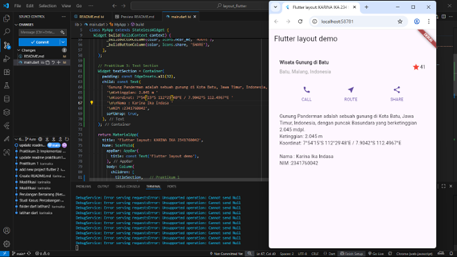
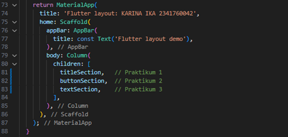
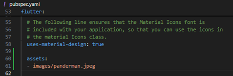
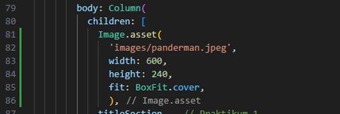
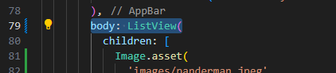
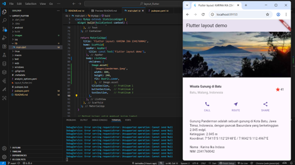

# 📱 Laporan Praktikum Pemrograman Mobile  

## Jobsheet 5 Flutter 2: Layout dan Navigasi

---

## 🙋‍♀️ Identitas  
- **Nama**  : Karina Ika Indasa  
- **NIM**   : 2341760042  
- **Kelas** : SIB-3C  
- **Mata Kuliah** : Pemrograman Mobile  

---

## 🎯 Tujuan Praktikum  
1. Menerapkan jenis-jenis layout.  
2. Menerapkan navigasi.  
3. Menerapkan routing.  

---

## 🛠️ Sumber Daya yang Dibutuhkan
- PC atau Laptop dengan spesifikasi minimum RAM 4GB Processor Core i3
- Koneksi internet
- Chrome Browser
- Perangkat mobile (Android/iOS)

--- 

## 📝 Langkah Praktikum  
### Praktikum 1: Membangun Layout di Flutter
**Langkah 1: Buat Project Baru**
- Buatlah sebuah project flutter baru dengan nama layout_flutter. Atau sesuaikan style laporan praktikum yang Anda buat.

    

    

**Langkah 2: Buka file lib/main.dart**
- Buka file main.dart lalu ganti dengan kode berikut. Isi nama dan NIM Anda di text title.

    

**Langkah 3: Identifikasi layout diagram**
- Langkah pertama adalah memecah tata letak menjadi elemen dasarnya:
    - Identifikasi baris dan kolom.
    - Apakah tata letaknya menyertakan kisi-kisi (grid)?
    - Apakah ada elemen yang tumpang tindih?
    - Apakah UI memerlukan tab?
  
  Perhatikan area yang memerlukan alignment, padding, atau borders.

    

  Selanjutnya, buat diagram setiap baris. Baris pertama, disebut bagian Judul, memiliki 3 anak: kolom teks, ikon bintang, dan angka. Anak pertamanya, kolom, berisi 2 baris teks. Kolom pertama itu memakan banyak ruang, sehingga harus dibungkus dengan widget yang Diperluas.

    

  Baris kedua, disebut bagian Tombol, juga memiliki 3 anak: setiap anak merupakan kolom yang berisi ikon dan teks.

    
  
  Setelah tata letak telah dibuat diagramnya, cara termudah adalah dengan menerapkan pendekatan bottom-up. Untuk meminimalkan kebingungan visual dari kode tata letak yang banyak bertumpuk, tempatkan beberapa implementasi dalam variabel dan fungsi.

**Langkah 4: Implementasi title row**
- Pertama, Anda akan membuat kolom bagian kiri pada judul. Tambahkan kode berikut di bagian atas metode build() di dalam kelas MyApp:

    

- /* soal 1 */ Letakkan widget Column di dalam widget Expanded agar menyesuaikan ruang yang tersisa di dalam widget Row. Tambahkan properti crossAxisAlignment ke CrossAxisAlignment.start sehingga posisi kolom berada di awal baris.

- /* soal 2 */ Letakkan baris pertama teks di dalam Container sehingga memungkinkan Anda untuk menambahkan padding = 8. Teks ‘Batu, Malang, Indonesia' di dalam Column, set warna menjadi abu-abu.

- /* soal 3 */ Dua item terakhir di baris judul adalah ikon bintang, set dengan warna merah, dan teks "41". Seluruh baris ada di dalam Container dan beri padding di sepanjang setiap tepinya sebesar 32 piksel. Kemudian ganti isi body text ‘Hello World' dengan variabel titleSection seperti berikut: 

    

### Praktikum 2: Implementasi button row
**Langkah 1: Buat method Column _buildButtonColumn**
- Bagian tombol berisi 3 kolom yang menggunakan tata letak yang sama—sebuah ikon di atas baris teks. Kolom pada baris ini diberi jarak yang sama, dan teks serta ikon diberi warna primer.

  Karena kode untuk membangun setiap kolom hampir sama, buatlah metode pembantu pribadi bernama buildButtonColumn(), yang mempunyai parameter warna, Icon dan Text, sehingga dapat mengembalikan kolom dengan widgetnya sesuai dengan warna tertentu.

  lib/main.dart (_buildButtonColumn)

    

**Langkah 2: Buat widget buttonSection**
- Bagian tombol berisi 3 kolom yang menggunakan tata letak yang sama—sebuah ikon di atas baris teks. Kolom pada baris ini diberi jarak yang sama, dan teks serta ikon diberi warna primer.

  Karena kode untuk membangun setiap kolom hampir sama, buatlah metode pembantu pribadi bernama buildButtonColumn(), yang mempunyai parameter warna, Icon dan Text, sehingga dapat mengembalikan kolom dengan widgetnya sesuai dengan warna tertentu.

  lib/main.dart (_buildButtonColumn)

    

**Langkah 3: Tambah button section ke body**
- Tambahkan variabel buttonSection ke dalam body seperti berikut:

    

### Praktikum 3: Implementasi text section
**Langkah 1: Buat widget textSection**
- Tentukan bagian teks sebagai variabel. Masukkan teks ke dalam Container dan tambahkan padding di sepanjang setiap tepinya. Tambahkan kode berikut tepat di bawah deklarasi buttonSection:

    

  Dengan memberi nilai softWrap = true, baris teks akan memenuhi lebar kolom sebelum membungkusnya pada batas kata.

**Langkah 2: Tambahkan variabel text section ke body**
- Tambahkan widget variabel textSection ke dalam body seperti berikut:

    

### Praktikum 4: Implementasi image section
**Langkah 1: Siapkan aset gambar**
- Anda dapat mencari gambar di internet yang ingin ditampilkan. Buatlah folder images di root project layout_flutter. Masukkan file gambar tersebut ke folder images, lalu set nama file tersebut ke file pubspec.yaml seperti berikut:

    

  Dengan memberi nilai softWrap = true, baris teks akan memenuhi lebar kolom sebelum membungkusnya pada batas kata.

**Langkah 2: Tambahkan gambar ke body**
- Tambahkan aset gambar ke dalam body seperti berikut:

    

  BoxFit.cover memberi tahu kerangka kerja bahwa gambar harus sekecil mungkin tetapi menutupi seluruh kotak rendernya.

**Langkah 3: Terakhir, ubah menjadi ListView**
- Pada langkah terakhir ini, atur semua elemen dalam ListView, bukan Column, karena ListView mendukung scroll yang dinamis saat aplikasi dijalankan pada perangkat yang resolusinya lebih kecil.

    

    
