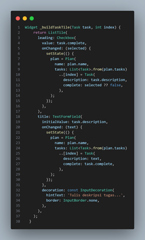
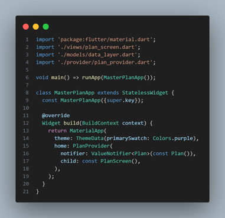
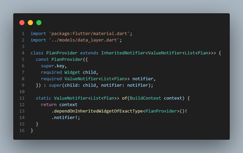
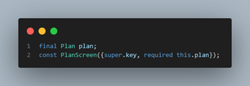
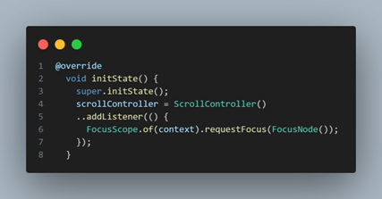

# 📱 Laporan Praktikum Pemrograman Mobile  

## Jobsheet 10 : Dasar State Manaagement

---

## 🙋‍♀️ Identitas  
- **Nama**  : Karina Ika Indasa  
- **NIM**   : 2341760042  
- **Kelas** : SIB-3C  
- **Mata Kuliah** : Pemrograman Mobile  

---

## 📝 Langkah Praktikum
### Praktikum 1: Dasar State dengan Model-View
- Langkah 1: Buat Project Baru

- Langkah 2: Membuat model task.dart

  

- Langkah 3: Buat file plan.dart

  

- Langkah 4: Buat file data_layer.dart

  

- Langkah 5: Pindah ke file main.dart

  

- Langkah 6: Buat file plan_screen.dart

  

- Langkah 7: buat method _buildAddTaskButton()*

  

- Langkah 8: buat widget _buildList()

  

- Langkah 9: buat widget _buildTaskTile

  

- Run

  

- Langkah 10: Tambah Scroll Controller

  

- Langkah 11: Tambah Scroll Listener

  

- Langkah 12: Tambah controller dan keyboard behavior

  

- Langkah 13: Terakhir, tambah method dispose()

  

- Langkah 14: Hasil

  

---

### Tugas Praktikum 1: Dasar State dengan Model-View
**1. Jelaskan maksud dari langkah 4 pada praktikum tersebut! Mengapa dilakukan demikian?**

Jawab: Berfungsi sebagai penghubung (data aggregator) antara seluruh model yang ada di folder models. Mengapa dilakukan demikian:

- Untuk mempermudah pengelolaan data layer, terutama saat model bertambah banyak.
- Membuat struktur proyek lebih bersih dan modular, sesuai prinsip clean architecture.
- Mengurangi redundancy dalam proses import di file lain (misalnya di plan_screen.dart).

**2.	Mengapa perlu variabel plan di langkah 6 pada praktikum tersebut? Mengapa dibuat konstanta ?**

Jawab: 

Fungsinya:
- Variabel plan digunakan untuk menyimpan dan memanipulasi daftar tugas (tasks) yang dibuat oleh pengguna.
- Nilai plan akan selalu berubah setiap kali user menambah tugas baru, mengedit deskripsi, atau mencentang tugas selesai.

Mengapa dibuat const (konstanta):
- Karena nilai awal Plan() bersifat immutable (tidak berubah) saat pertama kali dibuat.
- Flutter menggunakan const agar objek tidak dibuat ulang di memori setiap kali widget di-rebuild, sehingga lebih efisien dan hemat performa.
- Ketika ada perubahan (misalnya tambah tugas), objek Plan lama akan diganti dengan objek Plan baru menggunakan setState().

**3. Lakukan capture hasil dari Langkah 9 berupa GIF, kemudian jelaskan apa yang telah Anda buat!**

Jawab: Menampilkan setiap tugas dalam bentuk ListTile berisi:

- Checkbox → untuk menandai apakah tugas sudah selesai (task.complete).
- TextFormField → untuk mengubah deskripsi tugas (task.description).

Saat user mengetik atau mencentang tugas, fungsi setState() akan dipanggil untuk:
- Membuat objek Plan baru dengan daftar tugas yang sudah diperbarui.
- Menampilkan langsung perubahan di layar tanpa restart aplikasi.

**4. Apa kegunaan method pada Langkah 11 dan 13 dalam lifecyle state ?**

Jawab: 

Langkah 11 – initState()
- Dipanggil sekali saja saat widget pertama kali dibuat.
- Di sini digunakan untuk menginisialisasi ScrollController dan menambahkan listener yang otomatis menutup keyboard saat pengguna melakukan scroll.
- Ini menjaga agar tampilan tetap rapi dan tidak menutupi teks di bagian bawah layar.

Langkah 13 – dispose()
- Dipanggil saat widget dihapus dari tree (misalnya berpindah halaman).
- Digunakan untuk membersihkan resource yang digunakan controller, mencegah memory leak.
- Ini bagian penting dari siklus hidup (lifecycle) widget StatefulWidget.

---

### Praktikum 2: : Mengelola Data Layer dengan InheritedWidget dan InheritedNotifier
- Langkah 1: Buat file plan_provider.dart

  

- Langkah 2: Edit main.dart

  

- Langkah 3: Tambah method pada model plan.dart

  

- Langkah 4: Pindah ke PlanScreen

  

- Langkah 5: Edit method _buildAddTaskButton

  

- Langkah 6: Edit method _buildTaskTile

  

- Langkah 7: Edit _buildList

  

- Langkah 8: Tetap di class PlanScreen

  

- Langkah 9: Tambah widget SafeArea

  

- Run

  

---

### Tugas Praktikum 2: InheritedWidget
**1. Jelaskan mana yang dimaksud InheritedWidget pada langkah 1 tersebut! Mengapa yang digunakan InheritedNotifier?**

Jawab: Pada langkah 1, kita membuat class PlanProvider yang extends dari InheritedNotifier<ValueNotifier<Plan>>. Karena kita ingin agar UI bisa langsung ter-update otomatis ketika data berubah.

InheritedWidget = mewariskan data secara statis.
InheritedNotifier = mewariskan data dan memantau perubahan data agar UI otomatis update.

**2. Jelaskan maksud dari method di langkah 3 pada praktikum tersebut! Mengapa dilakukan demikian?**

Jawab:

- completedCount menghitung jumlah task yang sudah selesai (complete = true).
- completenessMessage membuat pesan progress yang menampilkan berapa banyak tugas selesai dari total tugas.

Supaya kita bisa menampilkan progress pekerjaan secara dinamis di UI.

**3. Lakukan capture hasil dari Langkah 9 berupa GIF, kemudian jelaskan apa yang telah Anda buat!**

Jawab:

- Tampilan akhir menggunakan InheritedNotifier melalui PlanProvider agar data Plan bisa diakses dan dipantau dari seluruh widget di bawahnya.
- ValueListenableBuilder digunakan agar widget dapat mendengarkan perubahan dari PlanProvider dan membangun ulang tampilan UI otomatis setiap kali data berubah.
- SafeArea digunakan agar teks progress di bagian bawah tidak tertutup area sistem (seperti navigation bar).

---

### Praktikum 3: Membuat State di Multiple Screens
- Langkah 1: Edit PlanProvider

  

- Langkah 2: Edit PlanProvider

  

- Langkah 3: Edit plan_screen.dart

  

- Langkah 4: Error

  

- Langkah 5: Tambah getter Plan

  

- Langkah 6 : Method initState()

  

- Langkah 7: Widget build

  

- Langkah 8: Edit _buildTaskTile

  

- Langkah 9: Buat screen baru

  
  
  

- Langkah 10: Pindah ke class _PlanCreatorScreenState

  

- Langkah 11: Pindah ke method build

  

- Langkah 12: Buat widget _buildListCreator

  

- Langkah 13: Buat void addPlan()

  

- Langkah 14 : Buat widget _buildMasterPlans()

  

- Run

  

---

