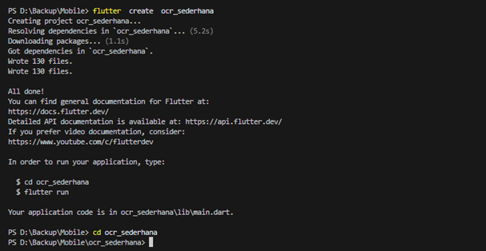

# 📱 Laporan Praktikum Pemrograman Mobile  

## Jobsheet 7 : Aplikasi OCR Sederhana dengan Flutter

---

## 🙋‍♀️ Identitas  
- **Nama**  : Karina Ika Indasa  
- **NIM**   : 2341760042  
- **Kelas** : SIB-3C  
- **Mata Kuliah** : Pemrograman Mobile  

---

## 🎯 Tujuan Praktikum  
Setelah menyelesaikan jobsheet ini, siswa/mahasiswa mampu:
1.	Membuat aplikasi Flutter multi-halaman.
2.	Menggunakan plugin kamera untuk mengambil gambar.
3.	Mengintegrasikan OCR (Optical Character Recognition) menggunakan library
google mlkit text recognition.
4.	Menampilkan hasil OCR di halaman terpisah.
5.	Menerapkan navigasi dasar antar layar menggunakan Navigator.

---

## 🛠️ ALat dan Bahan
- Laptop/komputer dengan Flutter SDK terinstal
- VS Code atau Android Studio
- Emulator Android atau perangkat Android fisik
- Koneksi internet (untuk instalasi dependensi)

---

## 📝 Langkah Praktikum
**4.1 Langkah 1: Buat Proyek baru**
- Buka terminal, lalu jalankan:

```bash
flutter  create  ocr_sederhana
cd  ocr_sederhana
```

  


