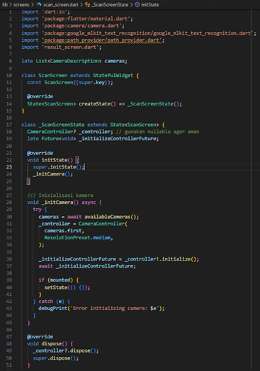

# 📱 Laporan Praktikum Pemrograman Mobile  

## Jobsheet 7 : Aplikasi OCR Sederhana dengan Flutter

---

## 🙋‍♀️ Identitas  
- **Nama**  : Karina Ika Indasa  
- **NIM**   : 2341760042  
- **Kelas** : SIB-3C  
- **Mata Kuliah** : Pemrograman Mobile  

---

## 🎯 Tujuan Praktikum  
Setelah menyelesaikan jobsheet ini, siswa/mahasiswa mampu:
1.	Membuat aplikasi Flutter multi-halaman.
2.	Menggunakan plugin kamera untuk mengambil gambar.
3.	Mengintegrasikan OCR (Optical Character Recognition) menggunakan library
google mlkit text recognition.
4.	Menampilkan hasil OCR di halaman terpisah.
5.	Menerapkan navigasi dasar antar layar menggunakan Navigator.

---

## 🛠️ ALat dan Bahan
- Laptop/komputer dengan Flutter SDK terinstal
- VS Code atau Android Studio
- Emulator Android atau perangkat Android fisik
- Koneksi internet (untuk instalasi dependensi)

---

## 📝 Langkah Praktikum
**Langkah 1: Buat Proyek baru**
- Buka terminal, lalu jalankan:

```bash
flutter  create  ocr_sederhana
cd  ocr_sederhana
```

  

**Langkah 2: Tambahkan Plugin**
- Buka file pubspec.yaml, lalu tambahkan dependensi berikut di bawah bagian dependencies:

```yaml
dependencies:
  flutter:
    sdk: flutter
  google_mlkit_text_recognition: ^0.10.0
  camera: ^0.10.5+5
  path_provider: ^2.1.2
  path: ^1.8.3
```

  
  

**Langkah 3: Tambahkan Izin Kamera (Android)**
- Buka file: android/app/src/main/AndroidManifest.xml
Tambahkan baris berikut di dalam tag <manifest>, sebelum <application>:

```xml
<uses - permission  android:name =" android . permission . CAMERA "  / >
```

  

**Langkah 4: Buat Struktur Folder**
- Di dalam folder lib/, buat struktur berikut:

```css
lib/
├── main.dart
└── screens/
    ├── splash_screen.dart
    ├── home_screen.dart
    ├── scan_screen.dart
    └── result_screen.dart
```

  

**Kode Program**
- File: lib/main.dart

```dart
import 'package:flutter/material.dart';
import 'screens/splash_screen.dart';

void main() {
  runApp(const MyApp());
}

class MyApp extends StatelessWidget {
  const MyApp({super.key});

  @override
  Widget build(BuildContext context) {
    return MaterialApp(
      title: 'OCR Sederhana',
      theme: ThemeData(
        primarySwatch: Colors.blue,
      ),
      home: const SplashScreen(),
      debugShowCheckedModeBanner: false,
    );
  }
}
```

  

- File: lib/screens/splash_screen.dart

```dart
import 'dart:async';
import 'package:flutter/material.dart';
import 'home_screen.dart';

class SplashScreen extends StatefulWidget {
  const SplashScreen({super.key});

  @override
  State<SplashScreen> createState() => _SplashScreenState();
}

class _SplashScreenState extends State<SplashScreen> {
  @override
  void initState() {
    super.initState();
    // Setelah 2 detik, pindah ke halaman HomeScreen
    Timer(const Duration(seconds: 2), () {
      Navigator.pushReplacement(
        context,
        MaterialPageRoute(builder: (_) => const HomeScreen()),
      );
    });
  }

  @override
  Widget build(BuildContext context) {
    return Scaffold(
      backgroundColor: Colors.blue,
      body: Center(
        child: Column(
          mainAxisAlignment: MainAxisAlignment.center,
          children: const [
            CircularProgressIndicator(color: Colors.white),
            SizedBox(height: 20),
            Text(
              'OCR Scanner',
              style: TextStyle(
                color: Colors.white,
                fontSize: 24,
              ),
            ),
          ],
        ),
      ),
    );
  }
}
```
  

- File: lib/screens/home_screen.dart

```dart
import 'package:flutter/material.dart';
import 'scan_screen.dart';

class HomeScreen extends StatelessWidget {
  const HomeScreen({super.key});

  @override
  Widget build(BuildContext context) {
    return Scaffold(
      appBar: AppBar(
        title: const Text('Menu Utama'),
      ),
      body: Center(
        child: ElevatedButton(
          onPressed: () {
            // Navigasi ke halaman ScanScreen
            Navigator.push(
              context,
              MaterialPageRoute(builder: (_) => const ScanScreen()),
            );
          },
          child: const Text('Mulai Scan Teks'),
        ),
      ),
    );
  }
}
```

  

- File: lib/screens/scan_screen.dart

```dart
import 'dart:io';
import 'package:flutter/material.dart';
import 'package:camera/camera.dart';
import 'package:google_mlkit_text_recognition/google_mlkit_text_recognition.dart';
import 'package:path/path.dart' as path;
import 'package:path_provider/path_provider.dart';
import 'result_screen.dart';

late List<CameraDescription> cameras;

class ScanScreen extends StatefulWidget {
  const ScanScreen({super.key});

  @override
  State<ScanScreen> createState() => _ScanScreenState();
}

class _ScanScreenState extends State<ScanScreen> {
  late CameraController _controller;
  late Future<void> _initializeControllerFuture;

  @override
  void initState() {
    super.initState();
    _initCamera();
  }

  // Inisialisasi kamera
  void _initCamera() async {
    cameras = await availableCameras();
    _controller = CameraController(cameras[0], ResolutionPreset.medium);
    _initializeControllerFuture = _controller.initialize();
    if (mounted) {
      setState(() {});
    }
  }

  @override
  void dispose() {
    _controller.dispose();
    super.dispose();
  }

  // Proses OCR dari file gambar
  Future<String> _ocrFromFile(File imageFile) async {
    final inputImage = InputImage.fromFile(imageFile);
    final textRecognizer = TextRecognizer(script: TextRecognitionScript.latin);
    final RecognizedText recognizedText =
        await textRecognizer.processImage(inputImage);
    textRecognizer.close();
    return recognizedText.text;
  }

  // Ambil foto dan proses hasil OCR
  Future<void> _takePicture() async {
    try {
      await _initializeControllerFuture;

      if (!mounted) return;

      ScaffoldMessenger.of(context).showSnackBar(
        const SnackBar(
          content: Text('Memproses OCR, mohon tunggu...'),
          duration: Duration(seconds: 2),
        ),
      );

      final XFile image = await _controller.takePicture();
      final ocrText = await _ocrFromFile(File(image.path));

      if (!mounted) return;

      Navigator.push(
        context,
        MaterialPageRoute(
          builder: (_) => ResultScreen(ocrText: ocrText),
        ),
      );
    } catch (e) {
      if (!mounted) return;
      ScaffoldMessenger.of(context).showSnackBar(
        SnackBar(content: Text('Error saat mengambil/memproses foto: $e')),
      );
    }
  }

  @override
  Widget build(BuildContext context) {
    if (!_controller.value.isInitialized) {
      return const Scaffold(
        body: Center(child: CircularProgressIndicator()),
      );
    }

    return Scaffold(
      appBar: AppBar(
        title: const Text('Kamera OCR'),
      ),
      body: Column(
        children: [
          Expanded(
            child: AspectRatio(
              aspectRatio: _controller.value.aspectRatio,
              child: CameraPreview(_controller),
            ),
          ),
          Padding(
            padding: const EdgeInsets.all(16.0),
            child: ElevatedButton.icon(
              onPressed: _takePicture,
              icon: const Icon(Icons.camera),
              label: const Text('Ambil Foto & Scan'),
            ),
          ),
        ],
      ),
    );
  }
}
```

  

  

- File: lib/screens/result_screen.dart

```dart
import 'package:flutter/material.dart';

class ResultScreen extends StatelessWidget {
  final String ocrText;

  const ResultScreen({super.key, required this.ocrText});

  @override
  Widget build(BuildContext context) {
    return Scaffold(
      appBar: AppBar(
        title: const Text('Hasil OCR'),
      ),
      body: Padding(
        padding: const EdgeInsets.all(16.0),
        child: SingleChildScrollView(
          child: SelectableText(
            ocrText.isEmpty
                ? 'Tidak ada teks ditemukan.'
                : ocrText.replaceAll('\n', ' '),
            style: const TextStyle(fontSize: 18),
          ),
        ),
      ),
    );
  }
}
```

  
